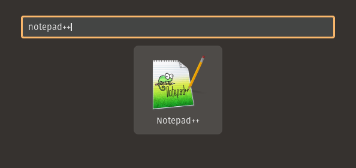

# Como instalar Notepad++ no Linux? (via Snap)

Este repositório documenta como instalar o **Notepad++ no Linux** utilizando o **Snap**, que executa o editor através do **Wine**, permitindo uma experiência muito próxima da versão nativa do Windows.

## 📦 Pré-requisitos

Antes de prosseguir, certifique-se de que o **Snap** esteja instalado no sistema.

O que é snap?

- formato de empacotamento de software universal da Canonical para Linux, facilitando a instalação de apps em várias distribuições.

Para verificar:
```bash
snap --version
```

**Caso não esteja instalado:**

**Ubuntu e derivados**
```bash
sudo apt update
sudo apt install snapd
```

**Para instalar o Notepad++ utilizando o Snap (canal edge):**

```bash
sudo snap install notepad-plus-plus --edge
```

⚠️ O canal edge é utilizado porque oferece a versão mais recente e com melhor compatibilidade no Linux.

Você pode executar digitando em seu terminal:

```bash
notepad-plus-plus
```

Ou basta procurar no Notepad++ no seu menu gráfico:



**ℹ️ Observações**

* O Notepad++ roda no Linux por meio do Wine, encapsulado pelo Snap.

* A interface e funcionalidades são praticamente idênticas à versão Windows.

* Pequenas diferenças de desempenho ou integração podem ocorrer.

**🗑️ Desinstalação**

Para remover o Notepad++ do sistema:

```bash
sudo snap remove notepad-plus-plus
```

#### ⭐ Se este guia foi útil, considere dar uma estrela no repositório!
